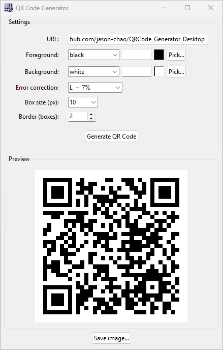

# 📷 Good QR Code Generator

[](LICENSE)

A desktop app that generates standard QR codes — locally, privately, and without fuss. Available on Windows, macOS, and Linux.

Most online QR code tools make you sign up, show you ads, log what you encode, or wrap your code in a redirect that breaks the day they shut down. **Good QR Code Generator** runs entirely on your computer. No internet connection, no account, no tracking — just a QR code that works.



## ✨ What you can do with it

- 🔲 Encode any URL or text into a standard, scanner-compatible QR code
- 🎨 Choose foreground and background colours (named colours, hex codes, or transparent background)
- 🖱️ Visual colour picker with live swatch preview
- 🛡️ Set error correction level (L / M / Q / H) — higher levels let the QR code survive damage or partial obscuring
- 📐 Adjust module size and quiet-zone border to suit print or screen use
- 👁️ Preview the result before saving, with a checkerboard pattern for transparent backgrounds
- 💾 Save as PNG, JPEG, BMP, GIF, TIFF, WebP, or ICO
- ⚙️ Tweak default settings once in `config.ini` and never think about them again
- 📦 Build a standalone `.exe` / `.app` / binary — no Python installation needed on the target machine

## 🖥️ Requirements

- Python 3.10+
- Dependencies listed in `requirements.txt`:
  - `qrcode[pil]` >= 8.2
  - `Pillow` >= 12.1.1
  - `pyinstaller` >= 6.19.0 (build only)
- Test dependencies listed in `requirements-dev.txt`:
  - `pytest` >= 8.0

## 🎨 Generating the app icon

The icon is generated programmatically from `generate_icon.py` using Pillow:

```bash
python generate_icon.py
```

This produces:

| File | Used for |
|---|---|
| `assets/icon.png` | Tkinter window title-bar icon (all platforms) |
| `assets/icon.ico` | Windows taskbar / exe icon (multi-resolution: 16/32/48/256 px) |
| `assets/icon.icns` | macOS dock / `.app` bundle icon (macOS only; requires `iconutil`) |

Run the script once before building. The icon files are committed to the repository so this step is only needed if you want to regenerate or customise the icon.

## 🚀 Running from source

```bash
# Create and activate a virtual environment
python3 -m venv .venv
source .venv/bin/activate        # Windows: .venv\Scripts\activate

# Install dependencies
pip install -r requirements.txt

# Run the app
python qrcode_gen.py
```

## 🧪 Running the tests

```bash
# Install dev dependencies (includes pytest)
pip install -r requirements-dev.txt

# Run all tests
pytest tests/
```

Tests cover all pure functions: `ec_label_for`, `is_valid_hex`, `normalise_colour`, `generate_qr_image`, and `load_config`. The Tkinter UI is not tested as it requires a display.

## 📦 Building a standalone executable

Build scripts handle virtual environment creation, dependency installation, and PyInstaller packaging automatically.

**🐧 Linux**
```bash
bash build_linux.sh
# Output: dist/GoodQRCodeGen   (single file)
#         dist/config.ini
```

**🍎 macOS**
```bash
bash build_macos.sh
# Output: dist/GoodQRCodeGen       (single-file binary)
#         dist/GoodQRCodeGen.app   (.app bundle)
#         dist/config.ini
```

**🪟 Windows**
```bat
build_windows.bat
REM Output: dist\GoodQRCodeGen.exe  (single file)
REM         dist\config.ini
```

## ⚙️ Configuration

Default settings are stored in `config.ini` next to the executable. Edit it to change the startup defaults:

```ini
[defaults]
url              = https://github.com/jason-chao/QRCode_Generator_Desktop
foreground       = black
background       = white
error_correction = L   # L, M, Q, or H
box_size         = 10  # pixels per QR module (1–20)
border           = 2   # quiet-zone width in modules
```

## 📁 Project structure

```
qrcode-gen/
├── qrcode_gen.py          # Application source
├── qrcode_gen.spec        # PyInstaller spec (cross-platform)
├── generate_icon.py       # Generates assets/icon.{png,ico,icns}
├── config.ini             # Default settings
├── requirements.txt       # Runtime + build dependencies
├── requirements-dev.txt   # Dev/test dependencies
├── assets/
│   ├── icon.png           # 512×512 source PNG
│   ├── icon.ico           # Windows multi-resolution icon
│   └── icon.icns          # macOS icon bundle (macOS only)
├── tests/
│   └── test_qrcode_gen.py # pytest test suite
├── build_linux.sh
├── build_macos.sh
└── build_windows.bat
```
